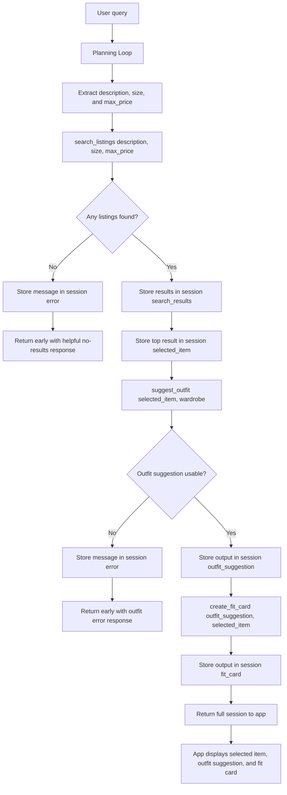

# FitFindr — planning.md

> Complete this document before writing any implementation code.
> Your spec and agent diagram are what you'll use to direct AI tools (Claude, Copilot, etc.) to generate your implementation — the more specific they are, the more useful the generated code will be.
> Your planning.md will be reviewed as part of your submission.
> Update it before starting any stretch features.

---

## Tools

List every tool your agent will use. For each tool, fill in all four fields.
You must have at least 3 tools. The three required tools are listed — add any additional tools below them.

### Tool 1: search_listings

**What it does:**
<!-- Describe what this tool does in 1–2 sentences --> Searches the mock secondhand listings dataset for items that match the user's requested item description, optional size, and maximum price. It filters listings by price first, then scores likely matches using the listing title, description, category, style tags, colors, brand, and platform.

**Input parameters:**
<!-- List each parameter, its type, and what it represents -->
- `description` (str): The user's natural language description of what they want, such as "vintage graphic tee" or "black platform shoes.
- `size` (str): The user's requested size, such as "M", "S/M", "W30", or "US 8". This can be None if the user does not provide a size.
- `max_price` (float): The highest price the user wants to pay. This can be None if the user does not provide a budget.

**What it returns:**
<!-- Describe the return value — what fields does a result contain? --> Returns a list of listing dictionaries sorted by relevance. Each result contains the original listing fields from the dataset: id, title, description, category, style_tags, size, condition, price, colors, brand, and platform.

**What happens if it fails or returns nothing:**
<!-- What should the agent do if no listings match? --> If no listings match, the tool returns an empty list []. The agent should store an error message in the session, tell the user that no matching listings were found, suggest loosening the size, description, or budget, and stop early instead of calling suggest_outfit or create_fit_card.

---

### Tool 2: suggest_outfit

**What it does:**
<!-- Describe what this tool does in 1–2 sentences --> Suggests one or more complete outfit combinations using the selected secondhand listing and the user's existing wardrobe. It uses the new item as the centerpiece and recommends wardrobe items that match the item's category, colors, style tags, and overall aesthetic.

**Input parameters:**
<!-- List each parameter, its type, and what it represents -->
- `new_item` (dict): The selected listing returned by search_listings. It should contain fields such as title, description, category, style_tags, size, condition, price, colors, brand, and platform.
- `wardrobe` (dict): wardrobe (dict): The user's wardrobe data. It should contain an items key with a list of wardrobe item dictionaries.

**What it returns:**
<!-- Describe the return value --> Returns a string containing a complete outfit suggestion. The suggestion should mention the new item, specific wardrobe pieces when available, and a short styling explanation such as why the pieces work together.

**What happens if it fails or returns nothing:**
<!-- What should the agent do if the wardrobe is empty or no outfit can be suggested? --> If the wardrobe is empty or minimal, the tool should still return a useful styling suggestion using general wardrobe basics instead of crashing. If the LLM call fails, the tool should return a clear fallback outfit suggestion string so the agent can continue to create_fit_card.

---

### Tool 3: create_fit_card

**What it does:**
<!-- Describe what this tool does in 1–2 sentences --> Generates a short, shareable outfit description based on the selected secondhand item and the outfit suggestion. The result should sound like a casual social media caption, not a product description.

**Input parameters:**
<!-- List each parameter, its type, and what it represents -->
- `outfit` (str): The outfit suggestion returned by suggest_outfit.
- `new_item` (dict): The selected listing returned by search_listings, including fields such as title, price, platform, colors, style_tags, and condition.

**What it returns:**
<!-- Describe the return value --> Returns a short caption-style string describing the outfit. The fit card should mention the thrifted item and styling vibe, and it should vary for different inputs.

**What happens if it fails or returns nothing:**
<!-- What should the agent do if the outfit data is incomplete? --> If the outfit input is missing, empty, or incomplete, the tool should return a clear error message string explaining that a fit card cannot be created without an outfit suggestion. The agent should show that message instead of crashing.

---

### Additional Tools (if any)

<!-- Copy the block above for any tools beyond the required three -->

---

## Planning Loop

**How does your agent decide which tool to call next?**
<!-- Describe the logic your planning loop uses. What does it look at? What conditions change its behavior? How does it know when it's done? --> The agent starts by reading the user's query and extracting three search inputs: description, size, and max_price. It then calls search_listings(description, size, max_price) first because the rest of the workflow depends on finding a real item.

After search_listings runs, the agent checks whether the returned results list is empty. If results == [], the agent stores a helpful error message in session["error"], leaves session["selected_item"], session["outfit_suggestion"], and session["fit_card"] as None, and returns early without calling the other tools.

If search results exist, the agent selects the first result as the best match and stores it in session["selected_item"]. Then it calls suggest_outfit(session["selected_item"], wardrobe) and stores the returned outfit suggestion in session["outfit_suggestion"].

Next, the agent checks whether the outfit suggestion is usable. If the suggestion is missing or empty, the agent stores an error message and returns early. If the suggestion exists, the agent calls create_fit_card(session["outfit_suggestion"], session["selected_item"]) and stores the result in session["fit_card"].

The loop is complete when the session contains either a final fit card or an error message explaining why the workflow stopped.

---

## State Management

**How does information from one tool get passed to the next?**
<!-- Describe how your agent stores and accesses state within a session. What data is tracked? How is it passed between tool calls? --> The agent uses a session dictionary to store information during one user interaction. At the start of a run, the session contains keys such as query, search_results, selected_item, outfit_suggestion, fit_card, and error.

After search_listings returns matches, the full results list is stored in session["search_results"], and the best match is stored in session["selected_item"]. This prevents the user from having to re-enter the item details before the outfit step.

The selected item is then passed from session["selected_item"] into suggest_outfit. The returned outfit text is stored in session["outfit_suggestion"].

Finally, create_fit_card receives both session["outfit_suggestion"] and session["selected_item"]. The final caption is stored in session["fit_card"].

If any step fails, the agent stores a message in session["error"] and returns the session early. This makes it clear which step failed and prevents later tools from receiving missing or invalid data.

---

## Error Handling

For each tool, describe the specific failure mode you're handling and what the agent does in response.

| Tool            | Failure mode                          | Agent response                                                                                                                                                                                                                                                                                   |
| --------------- | ------------------------------------- | ------------------------------------------------------------------------------------------------------------------------------------------------------------------------------------------------------------------------------------------------------------------------------------------------ |
| search_listings | No results match the query            | The agent stores an error in `session["error"]` and tells the user: "I couldn't find listings that match that description, size, and budget. Try a broader description, a different size, or a higher max price." The agent stops early and does not call `suggest_outfit` or `create_fit_card`. |
| suggest_outfit  | Wardrobe is empty                     | The tool returns a general styling suggestion using common basics such as jeans, sneakers, boots, or a simple jacket. The agent stores this in `session["outfit_suggestion"]` and continues to `create_fit_card` instead of crashing.                                                            |
| create_fit_card | Outfit input is missing or incomplete | The tool returns a clear message such as: "I need an outfit suggestion before I can create a fit card." The agent stores that message in `session["fit_card"]` or `session["error"]` and shows it to the user instead of raising an exception.                                                   |

---

## Architecture

<!-- Draw a diagram of your agent showing how the components connect:
     User input → Planning Loop → Tools (search_listings, suggest_outfit, create_fit_card)
                                                                          ↕
                                                                   State / Session
     Show what triggers each tool, how state flows between them, and where error paths branch off.
     ASCII art, a Mermaid diagram (https://mermaid.js.org/syntax/flowchart.html), or an embedded
     sketch are all fine. You'll share this diagram with an AI tool when asking it to implement
     the planning loop and each individual tool. -->

---

## AI Tool Plan

<!-- For each part of the implementation below, describe:
     - Which AI tool you plan to use (Claude, Copilot, ChatGPT, etc.)
     - What you'll give it as input (which sections of this planning.md, your agent diagram)
     - What you expect it to produce
     - How you'll verify the output matches your spec before moving on

     "I'll use AI to help me code" is not a plan.
     "I'll give Claude my Tool 1 spec (inputs, return value, failure mode) and ask it to implement
     search_listings() using load_listings() from the data loader — then test it against 3 queries
     before trusting it" is a plan. -->

**Milestone 3 — Individual tool implementations: I will use ChatGPT to help implement each required tool one at a time. For search_listings, I will give ChatGPT the Tool 1 spec from this planning document and ask it to implement search_listings(description, size, max_price) inside tools.py using load_listings() from utils/data_loader.py. I will verify the output by checking that it filters by price, handles optional size, scores matches using listing text fields, returns a list of listing dictionaries, and returns [] when nothing matches.

For suggest_outfit, I will give ChatGPT the Tool 2 spec and ask it to implement the function using the Groq LLM. I will verify that it accepts new_item and wardrobe, handles wardrobe["items"] when it is empty, and returns a useful string instead of crashing.

For create_fit_card, I will give ChatGPT the Tool 3 spec and ask it to implement the function using the Groq LLM. I will verify that it accepts both outfit and new_item, returns a short caption-style string, varies across different inputs, and returns a clear error message when the outfit input is empty.

**Milestone 4 — Planning loop and state management:** I will use ChatGPT to help implement run_agent() in agent.py using the Planning Loop, State Management, and Architecture sections of this planning document. I will give ChatGPT the Mermaid diagram and ask it to implement the conditional flow exactly: search first, stop early if no listings are found, store the selected item in the session if results exist, pass that selected item into suggest_outfit, then pass both the outfit suggestion and selected item into create_fit_card.

I will verify the generated code before using it by checking that it does not call all three tools unconditionally. I will test one successful query and one impossible query. The successful query should populate session["selected_item"], session["outfit_suggestion"], and session["fit_card"]; the impossible query should populate session["error"] and leave the later outputs as None.

---

## A Complete Interaction (Step by Step)

FitFindr is a multi-tool AI agent that helps a user find secondhand clothing, style the selected item with their existing wardrobe, and generate a short shareable fit card. The agent first searches the mock listing dataset based on the user's description, size, and budget. If it finds a usable item, it stores that item in session state, suggests an outfit using the wardrobe data, then creates a caption style fit card; if search fails, it stops early and gives the user a helpful message instead of calling the next tools.

**Example user query:** "I'm looking for a vintage graphic tee under $30. I mostly wear baggy jeans and chunky sneakers. What's out there and how would I style it?"

**Step 1:**
<!-- What does the agent do first? Which tool is called? With what input? --> The agent extracts description="vintage graphic tee", size=None, and max_price=30.0 from the user query. It calls search_listings("vintage graphic tee", size=None, max_price=30.0). The tool searches the mock listings dataset and returns matching listings such as a vintage-style graphic tee or band tee under the user's budget.

**Step 2:**
<!-- What happens next? What was returned from step 1? What tool is called now? --> The agent checks whether the search results list is empty. If it is empty, the agent stores an error message and stops. If results exist, the agent stores the full list in session["search_results"] and stores the first result in session["selected_item"]. For example, the selected item might be "Vintage Band Tee — Faded Grey" or "Graphic Tee — 2003 Tour Bootleg Style".

**Step 3:**
<!-- Continue until the full interaction is complete --> The agent calls suggest_outfit(session["selected_item"], wardrobe). The wardrobe contains items such as baggy jeans, sneakers, jackets, or other saved pieces. The tool returns an outfit suggestion that uses the selected thrifted tee as the centerpiece and pairs it with compatible wardrobe items.
**Step 4:**
The agent stores the outfit suggestion in session["outfit_suggestion"]. If the suggestion is usable, it calls create_fit_card(session["outfit_suggestion"], session["selected_item"]). This creates a short caption-style fit card based on both the selected listing and the outfit suggestion.

**Final output to user:**
<!-- What does the user actually see at the end? --> The user sees the selected thrift listing, a styling suggestion using their wardrobe, and a short shareable fit card. For example: "Found: Vintage Band Tee — Faded Grey, $19 on Depop. Style it with baggy dark-wash jeans and chunky sneakers for a relaxed grunge streetwear look. Fit card: thrifted a faded band tee and built the whole look around baggy denim and chunky sneakers — very casual 90s energy.